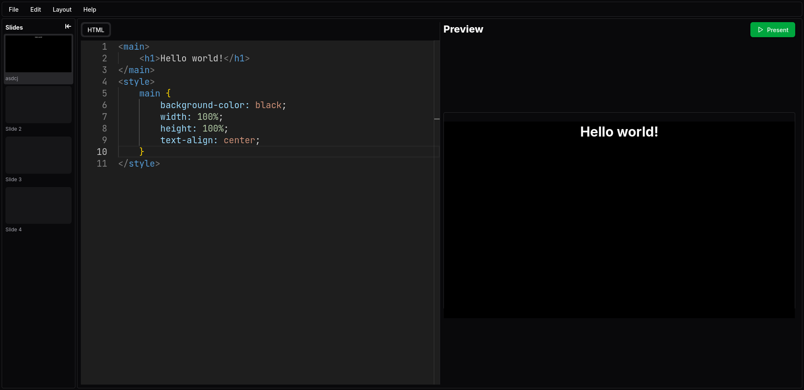

<h1 align="center">csslides</h1>

Create elegant presentations easily using HTML, CSS and Tailwind! 
<a align="center" href="https://csslides.7f454c46.xyz/">Website</a>

## About
We all hate PowerPoint, right? Why not write our presentations in something developer-friendly, like HTML and CSS? That's what `csslides` is for! It's a simple, easy-to-use tool that allows you to create presentations using HTML and CSS.

## Features

- **Easy to use**: Just write your slides in HTML and CSS, and you're good to go!
- **Customizable**: Use CSS to style your slides however you want.
- **Shareable**: Share your presentations with others by simply enabling sharing and copying the URL.

## Usage

1. Sign in with your email address(Don't worry, I won't send you anything!).
2. Create a new presentation.
3. Write your slides in HTML and CSS.
4. Save with the `Save` button or `<Ctrl+S>`.

## Licensing

This project is licensed under the MIT License. See the [LICENSE](LICENSE) file for more information.